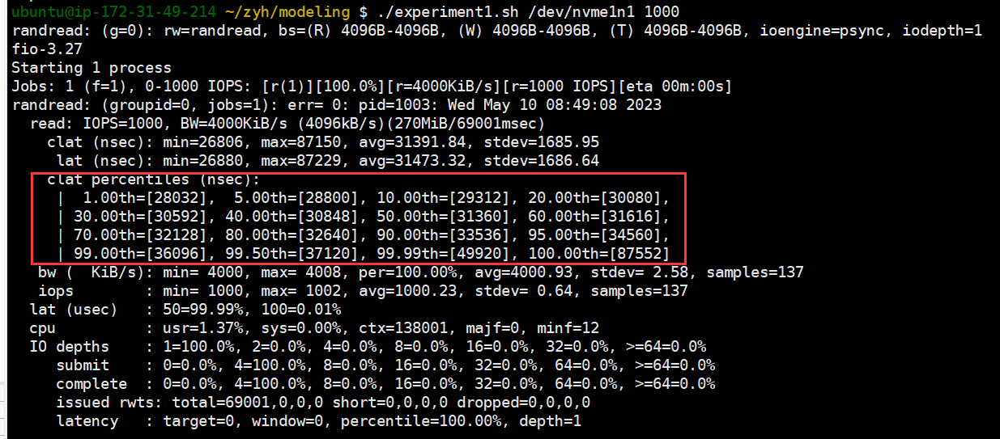

## Experiment 1
Experiment 1 uses the fio tool, after mounting the four types of AWS EBS volumes, to run directly:

``` 
    ./expermiment1.sh /dev/nvme2n1 1000 ## I/O presure below paid IOPS
    ./expermiment1.sh /dev/nvme2n1 6000 ## I/O presure exceed paid IOPS
```
We choose four types of EBS volumes all with 3000 IOPS of paid IOPS




## Experiment 2
Mount io2 volumes with different paid IOPS and run similar scripts. To ensure that the pressure on fio is sufficient when it has high paid IOPS, it is run with 10 threads uniformly.

``` shell
    ./expermiment2.sh /dev/nvme2n1 1000 ## I/O presure below paid IOPS
    ./expermiment2.sh /dev/nvme2n1 2000 ## I/O presure exceed paid IOPS
```

## Experiment 3
io2 volume with 100 GB and 1000 IOPS

1、Initializing the device
``` shell
    make init
    sudo ./init dev_name device_size(in sector) 1024
    (device_size can be gotten from *sudo fdisk -l*)
```

2、test
``` shell
    make test3
    sudo ./test3 /dev/nvme2n1 8 rand 100
    (sudo ./test3 dev_name io_size read_type(read/seq/jump) dev_size(GB))
```

Results are output in the file (testresult.log).
Eight columns of data will be output.

    num: the request seq
    b_t: the request start time stamp
    s_t: the time of ready to send to EBS
    sw_t: the request submission wait time,
    w_t: EBS processing time.
    u_t: Time from submission to completion
    e_t: the IO completion time
    user_t: User perception time


## EXperiment 4
io2 volume with 100 GB and different paid IOPS

```
    ./expermiment4.sh /dev/nvme2n1 1000 ## I/O presure below paid IOPS
    ./expermiment4.sh /dev/nvme2n1 2000 ## I/O presure exceed paid IOPS
```